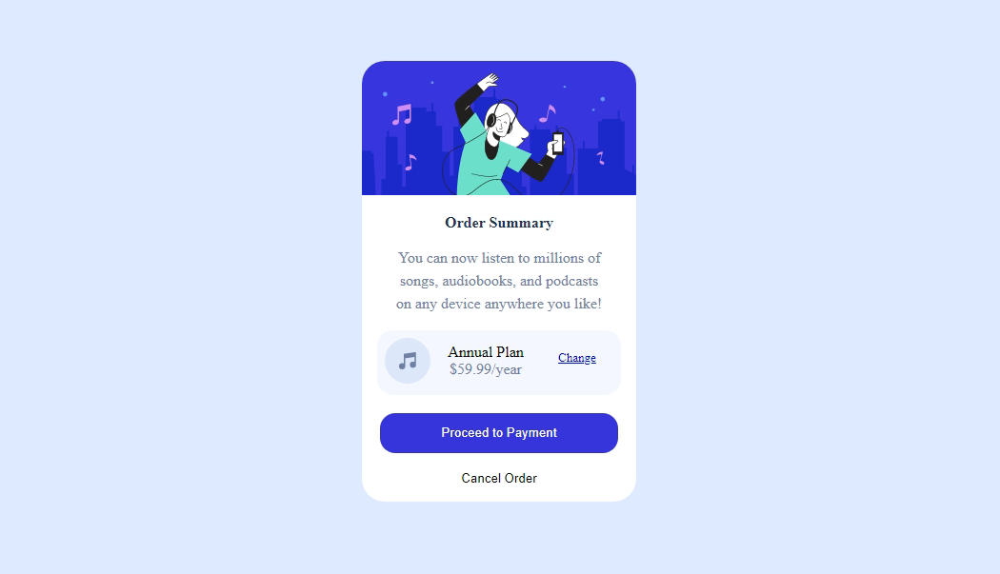

# Frontend Mentor - Order summary card solution

This is a solution to the [Order summary card challenge on Frontend Mentor](https://www.frontendmentor.io/challenges/order-summary-component-QlPmajDUj). Frontend Mentor challenges help you improve your coding skills by building realistic projects. 

## Table of contents

- [Overview](#overview)
  - [The challenge](#the-challenge)
  - [Screenshot](#screenshot)
  - [Links](#links)
  - [Built with](#built-with)
- [Author](#author)

## Overview

### The challenge

Users should be able to:

- See hover states for interactive elements

### Screenshot

### Links

- Solution URL: [https://www.frontendmentor.io/solutions/order-summary-component-using-html-and-css-kb7M7He0B](https://www.frontendmentor.io/solutions/order-summary-component-using-html-and-css-kb7M7He0B)
- Live Site URL: [https://friendly-ptolemy-c6a8b1.netlify.app](https://friendly-ptolemy-c6a8b1.netlify.app)

### Built with

- Semantic HTML5 markup
- CSS custom properties
- Flex
- Mobile-first workflow

## Author

- Frontend Mentor - [@thevarungrovers](https://www.frontendmentor.io/profile/thevarungrovers)
- Github - [@thevarungrovers](https://github.com/thevarungrovers)